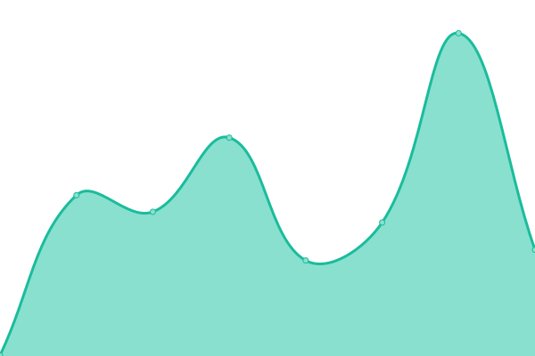

# [📈 Live Status](https://status.jsonsilo.com): <!--live status--> **🟩 All systems operational**

This repository contains the open-source uptime monitor and status page for [JSONSilo.com](jsonsilo.com), powered by [Upptime](https://github.com/upptime/upptime).

With [Upptime](https://upptime.js.org), you can get your own unlimited and free uptime monitor and status page, powered entirely by a GitHub repository. We use [Issues](https://github.com/JSONsilo/status/issues) as incident reports, [Actions](https://github.com/JSONsilo/status/actions) as uptime monitors, and [Pages](https://status.jsonsilo.com) for the status page.

<!--start: status pages-->
<!-- This summary is generated by Upptime (https://github.com/upptime/upptime) -->
<!-- Do not edit this manually, your changes will be overwritten -->
<!-- prettier-ignore -->
| URL | Status | History | Response Time | Uptime |
| --- | ------ | ------- | ------------- | ------ |
|  [JSONSilo.com](https://jsonsilo.com) | 🟩 Up | [json-silo-com.yml](https://github.com/JSONSilo/status/commits/HEAD/history/json-silo-com.yml) | 

 368ms
     
 | 

<a href="https://status.jsonsilo.com/history/json-silo-com">100.00%</a>
    

|  [Console](https://console.jsonsilo.com/signin) | 🟩 Up | [console.yml](https://github.com/JSONSilo/status/commits/HEAD/history/console.yml) | 

 2973ms
     
 | 

<a href="https://status.jsonsilo.com/history/console">99.43%</a>
    

|  [Platform API](https://platform.jsonsilo.com) | 🟩 Up | [platform-api.yml](https://github.com/JSONSilo/status/commits/HEAD/history/platform-api.yml) | 

 457ms
     
 | 

<a href="https://status.jsonsilo.com/history/platform-api">100.00%</a>
    

|  [API (EU)](https://api.jsonsilo.com) | 🟩 Up | [api-eu.yml](https://github.com/JSONSilo/status/commits/HEAD/history/api-eu.yml) | 

 385ms
     
 | 

<a href="https://status.jsonsilo.com/history/api-eu">100.00%</a>
    

|  [API (SG-01)](https://sg-01-api.jsonsilo.com) | 🟩 Up | [api-sg-01.yml](https://github.com/JSONSilo/status/commits/HEAD/history/api-sg-01.yml) | 

 2921ms
     
 | 

<a href="https://status.jsonsilo.com/history/api-sg-01">99.44%</a>
    

|  [API (USC-01)](https://usc-01-api.jsonsilo.com) | 🟩 Up | [api-usc-01.yml](https://github.com/JSONSilo/status/commits/HEAD/history/api-usc-01.yml) | 

 197ms
     
 | 

<a href="https://status.jsonsilo.com/history/api-usc-01">100.00%</a>
    

<!--end: status pages-->

[**Visit our status website →**](https://status.jsonsilo.com)

## 📄 License

- Powered by: [Upptime](https://github.com/upptime/upptime)
- Code: [MIT](./LICENSE) © [JSONSilo.com](jsonsilo.com)
- Data in the `./history` directory: [Open Database License](https://opendatacommons.org/licenses/odbl/1-0/)
